# モバイルオーダーシステム技術仕様書

## 1. 概要

本書は、レストランチェーン向けモバイルオーダーシステムの技術仕様について記述する。本システムは、顧客がスマートフォンから注文を行い、店舗側で効率的に注文処理を行うことを目的としている。

### 1.1 システムの目的

- 顧客の待ち時間削減
- 注文精度の向上
- 店舗オペレーションの効率化
- 売上データの一元管理

### 1.2 対象読者

- システム開発者
- プロジェクトマネージャー
- インフラエンジニア
- QAエンジニア

### 1.3 前提条件

本システムの開発にあたり、以下の技術スタックを採用する：

| 分野 | 技術 | バージョン |
|------|------|------------|
| フロントエンド | React Native | 0.72+ |
| バックエンド | Node.js | 18+ |
| データベース | PostgreSQL | 15+ |
| キャッシュ | Redis | 7+ |
| インフラ | AWS | - |

## 2. システム構成

### 2.1 全体アーキテクチャ

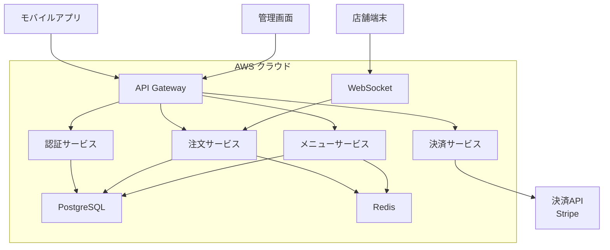

### 2.2 データフロー

注文処理のデータフローを以下に示す：

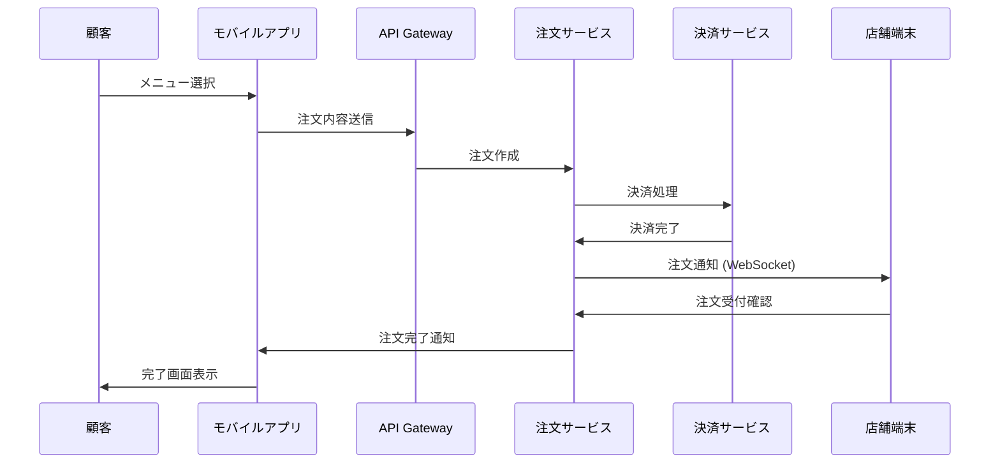

## 3. 機能要件

### 3.1 顧客向け機能

#### 3.1.1 ユーザー認証

- SNSログイン（Google、Apple、LINE）
- ゲスト注文機能
- 会員情報管理

#### 3.1.2 メニュー閲覧

- カテゴリ別メニュー表示
- 商品詳細情報
- アレルギー情報表示
- 栄養成分表示

#### 3.1.3 注文機能

- カート機能
- オプション選択
- 数量調整
- 注文履歴確認

顧客の注文プロセスは以下の状態遷移で管理される：

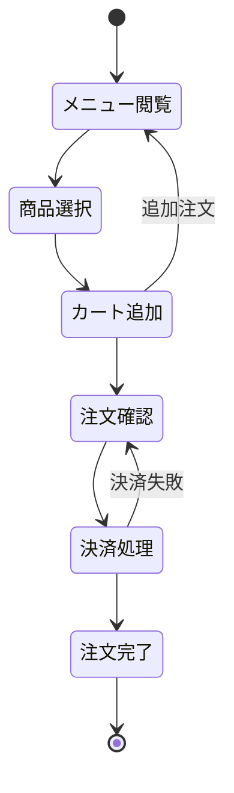

#### 3.1.4 決済機能

- クレジットカード決済
- 電子マネー決済
- QRコード決済
- ポイント利用

### 3.2 店舗向け機能

#### 3.2.1 注文管理

- リアルタイム注文受信
- 注文ステータス管理
- 調理時間見積もり
- 完了通知

#### 3.2.2 メニュー管理

- 商品情報更新
- 在庫状況反映
- 価格変更
- 販売停止設定

#### 3.2.3 レポート機能

- 売上分析
- 人気商品分析
- 時間帯別売上
- 月次・年次レポート

売上データの集計処理フローは以下の通り：

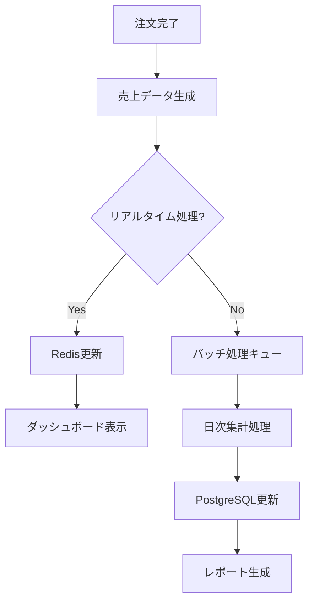

## 4. 非機能要件

### 4.1 性能要件

| 項目 | 要求値 |
|------|--------|
| 応答時間 | API: 200ms以下、画面遷移: 1秒以下 |
| 同時接続数 | 10,000ユーザー |
| スループット | 1,000 TPS |
| 可用性 | 99.9% |

### 4.2 セキュリティ要件

- HTTPS通信必須
- JWT認証
- API レート制限
- PCI DSS準拠
- 個人情報保護

### 4.3 運用要件

- 24時間365日監視
- 自動スケーリング
- ログ管理（CloudWatch）
- バックアップ（日次、週次、月次）

## 5. データベース設計

### 5.1 ER図

主要なエンティティ関係を以下に示す：

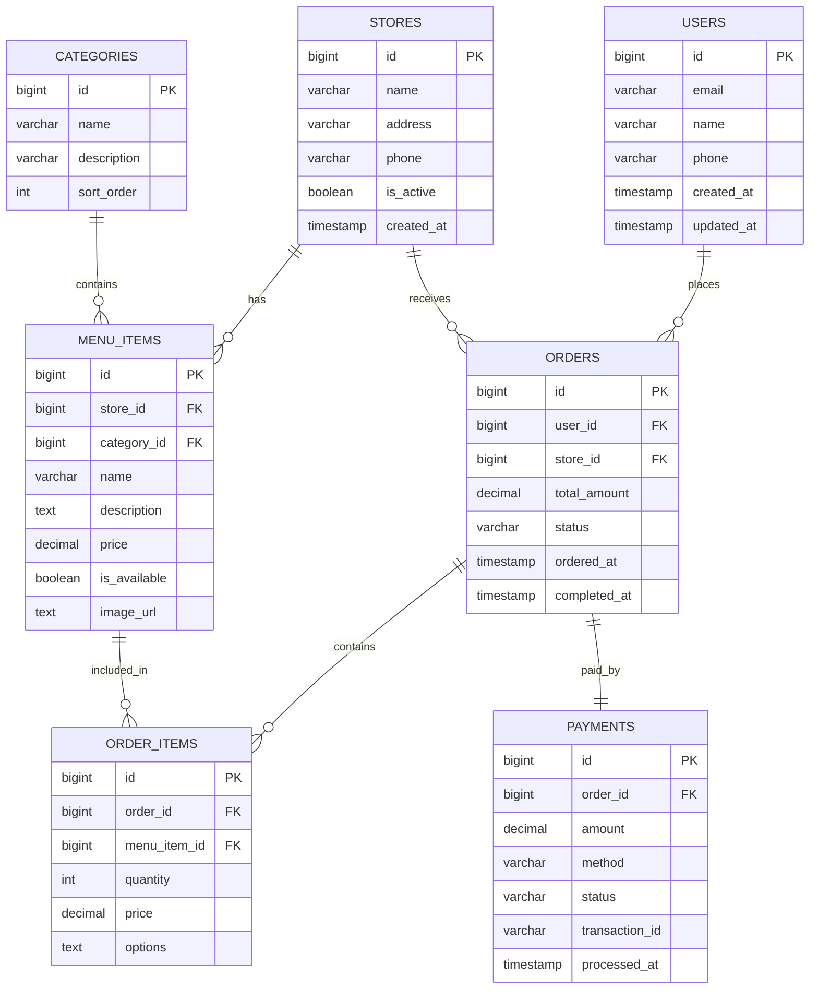

### 5.2 インデックス設計

性能向上のため、以下のインデックスを設定する：

```sql
-- 注文検索用
CREATE INDEX idx_orders_user_id_ordered_at ON orders(user_id, ordered_at DESC);
CREATE INDEX idx_orders_store_id_status ON orders(store_id, status);

-- メニュー検索用
CREATE INDEX idx_menu_items_store_id_category_id ON menu_items(store_id, category_id);
CREATE INDEX idx_menu_items_is_available ON menu_items(is_available) WHERE is_available = true;

-- 決済検索用
CREATE INDEX idx_payments_order_id ON payments(order_id);
CREATE INDEX idx_payments_status_processed_at ON payments(status, processed_at);
```

## 6. API設計

### 6.1 認証API

#### POST /api/auth/login

ユーザーログイン処理

**リクエスト**
```json
{
  "email": "user@example.com",
  "password": "password123",
  "device_id": "device_12345"
}
```

**レスポンス**
```json
{
  "success": true,
  "data": {
    "access_token": "eyJhbGciOiJIUzI1NiIs...",
    "refresh_token": "eyJhbGciOiJIUzI1NiIs...",
    "expires_in": 3600,
    "user": {
      "id": 1,
      "email": "user@example.com",
      "name": "田中太郎"
    }
  }
}
```

### 6.2 メニューAPI

#### GET /api/stores/{storeId}/menu

店舗のメニュー情報を取得

**パラメータ**
- `storeId`: 店舗ID（必須）
- `category`: カテゴリフィルター（オプション）

**レスポンス**
```json
{
  "success": true,
  "data": {
    "categories": [
      {
        "id": 1,
        "name": "メイン",
        "items": [
          {
            "id": 101,
            "name": "ハンバーガー",
            "description": "ジューシーなビーフパティを使用",
            "price": 580,
            "image_url": "https://example.com/burger.jpg",
            "is_available": true,
            "options": [
              {
                "name": "サイズ",
                "required": true,
                "choices": [
                  {"name": "レギュラー", "price": 0},
                  {"name": "ラージ", "price": 100}
                ]
              }
            ]
          }
        ]
      }
    ]
  }
}
```

### 6.3 注文API

#### POST /api/orders

新規注文作成

**リクエスト**
```json
{
  "store_id": 1,
  "items": [
    {
      "menu_item_id": 101,
      "quantity": 2,
      "options": {
        "size": "ラージ",
        "drink": "コーラ"
      }
    }
  ],
  "payment_method": "credit_card",
  "delivery_time": "2024-01-15T12:30:00Z"
}
```

**レスポンス**
```json
{
  "success": true,
  "data": {
    "order_id": 12345,
    "total_amount": 1160,
    "estimated_time": 15,
    "status": "confirmed"
  }
}
```

## 7. インフラ構成

### 7.1 AWS構成図

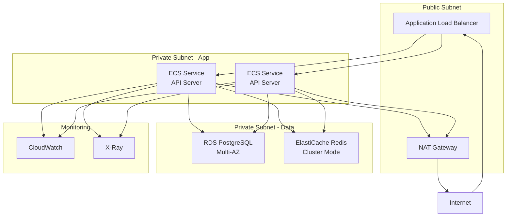

### 7.2 監視・アラート

#### 7.2.1 メトリクス監視

- CPU使用率（閾値: 80%）
- メモリ使用率（閾値: 85%）
- API応答時間（閾値: 500ms）
- エラー率（閾値: 1%）

#### 7.2.2 ログ監視

- アプリケーションログ
- アクセスログ
- エラーログ
- セキュリティログ

### 7.3 デプロイ戦略

デプロイプロセスは以下のフローで実行される：

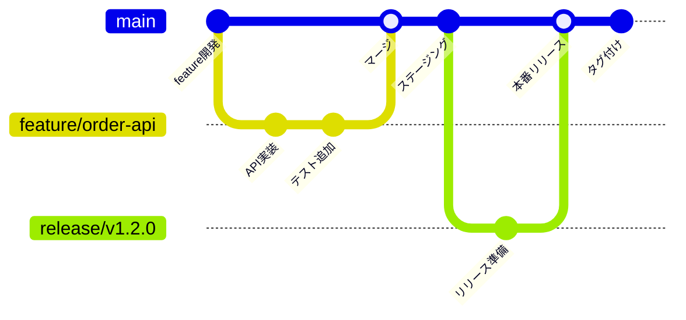

## 8. テスト戦略

### 8.1 テストピラミッド

```mermaid
pyramid
    title テストピラミッド
    level1 "E2Eテスト (5%)"
    level2 "統合テスト (15%)"
    level3 "単体テスト (80%)"
```

### 8.2 テスト種別

#### 8.2.1 単体テスト
- 関数・メソッドレベル
- カバレッジ80%以上
- Jest使用

#### 8.2.2 統合テスト
- API間連携
- データベース連携
- 外部サービス連携

#### 8.2.3 E2Eテスト
- ユーザーシナリオ
- クリティカルパス
- Playwright使用

### 8.3 負荷テスト

負荷テストのシナリオを以下に示す：

```mermaid
gantt
    title 負荷テストスケジュール
    dateFormat  X
    axisFormat  %s
    section 準備フェーズ
    環境構築    :0, 30
    テストデータ :20, 40
    section 実行フェーズ
    段階的負荷  :40, 100
    ピーク負荷  :90, 150
    耐久性テスト :140, 300
    section 分析フェーズ
    結果分析    :280, 350
    レポート作成 :330, 380
```

## 9. セキュリティ対策

### 9.1 認証・認可

- JWT（JSON Web Token）による認証
- ロールベースアクセス制御
- 多要素認証（MFA）対応

### 9.2 データ保護

- 保存時暗号化（AES-256）
- 転送時暗号化（TLS 1.3）
- 個人情報マスキング

### 9.3 脅威対策

主要なセキュリティ脅威と対策：

| 脅威 | 対策 |
|------|------|
| SQLインジェクション | パラメータ化クエリ |
| XSS | 入力値サニタイズ |
| CSRF | CSRFトークン |
| DDoS | WAF、レート制限 |
| 不正アクセス | IP制限、監査ログ |

## 10. 運用・保守

### 10.1 リリース管理

リリースプロセスは以下のステージで管理される：

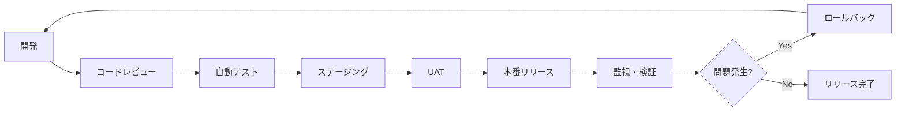

### 10.2 障害対応

#### 10.2.1 障害分類

| レベル | 定義 | 対応時間 |
|--------|------|----------|
| Critical | システム全体停止 | 30分以内 |
| High | 主要機能に影響 | 2時間以内 |
| Medium | 一部機能に影響 | 1営業日以内 |
| Low | 軽微な問題 | 1週間以内 |

#### 10.2.2 エスカレーション

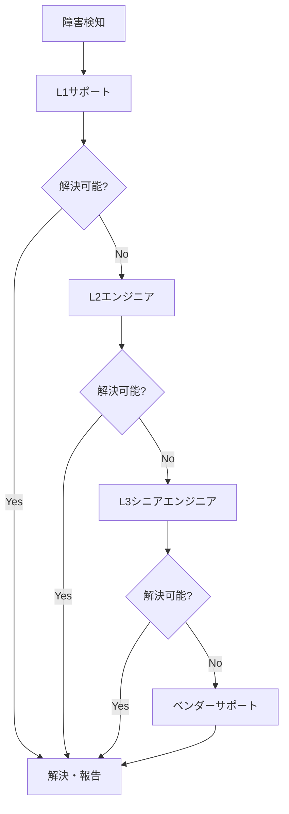

### 10.3 パフォーマンス最適化

#### 10.3.1 データベース最適化

- インデックス最適化
- クエリ性能分析
- パーティショニング
- 読み書き分離

#### 10.3.2 アプリケーション最適化

- コネクションプーリング
- 非同期処理
- キャッシュ戦略
- CDN活用

### 10.4 スケーリング戦略

トラフィック増加に対するスケーリング戦略：

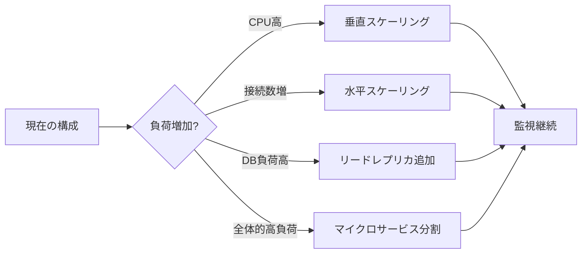

## 11. 付録

### 11.1 用語集

| 用語 | 定義 |
|------|------|
| API Gateway | APIの窓口となるサービス |
| JWT | JSON Web Token、認証トークン形式 |
| TPS | Transaction Per Second、秒間処理数 |
| CDN | Content Delivery Network |
| WAF | Web Application Firewall |

### 11.2 参考文献

1. AWS Well-Architected Framework
2. RESTful Web APIs（Leonard Richardson、Mike Amundsen著）
3. マイクロサービスパターン（Chris Richardson著）
4. 高性能Webサイト構築ガイド（Steve Souders著）

### 11.3 変更履歴

| バージョン | 日付 | 変更内容 | 担当者 |
|------------|------|----------|--------|
| 1.0 | 2024-01-15 | 初版作成 | 開発チーム |
| 1.1 | 2024-02-01 | セキュリティ要件追加 | セキュリティチーム |
| 1.2 | 2024-02-15 | API仕様詳細化 | APIチーム |

---

**本書に関するお問い合わせ**

技術仕様書に関するご質問は、開発チーム（dev-team@example.com）までお願いします。

**著作権表示**

© 2024 Example Restaurant Chain. All rights reserved.