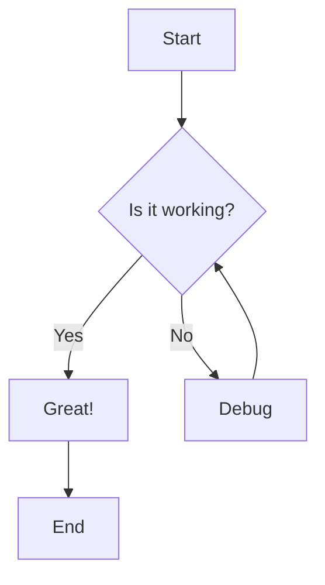
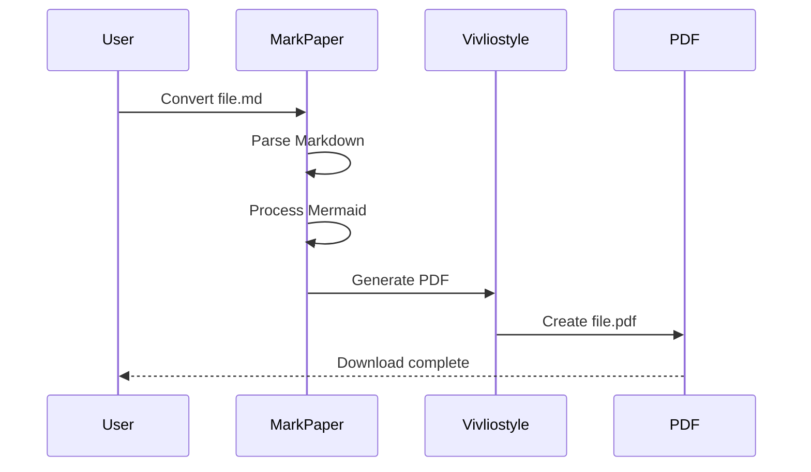
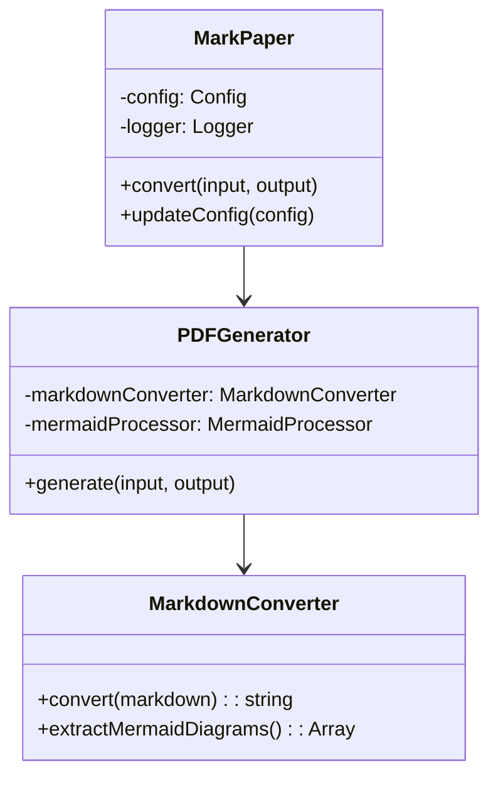

# MarkPaper Sample Document

This is a sample document to demonstrate the capabilities of MarkPaper.

## Features Overview

MarkPaper provides the following features:

- **Beautiful Typography**: Clean, professional fonts with proper spacing
- **Automatic Page Breaks**: Smart page breaks at heading boundaries
- **Mermaid Diagrams**: Automatic conversion of Mermaid code blocks
- **Code Highlighting**: Syntax highlighting for code blocks
- **Table Support**: Well-formatted tables with proper styling

## Typography Examples

### Headings

# Heading 1
## Heading 2
### Heading 3
#### Heading 4
##### Heading 5
###### Heading 6

### Text Formatting

This paragraph demonstrates **bold text**, *italic text*, and `inline code`. You can also use ~~strikethrough~~ text.

> This is a blockquote. It provides a nice way to highlight important information or quotes from other sources.

### Lists

#### Unordered List
- First item
- Second item
  - Nested item
  - Another nested item
- Third item

#### Ordered List
1. First step
2. Second step
   1. Sub-step A
   2. Sub-step B
3. Third step

## Code Examples

### Inline Code
Use `console.log()` to output information to the console.

### Code Block
```javascript
function greetUser(name) {
  console.log(`Hello, ${name}!`);
  return `Welcome to MarkPaper`;
}

// Usage
const message = greetUser("World");
console.log(message);
```

### Python Example
```python
def calculate_fibonacci(n):
    if n <= 1:
        return n
    return calculate_fibonacci(n-1) + calculate_fibonacci(n-2)

# Generate first 10 numbers
for i in range(10):
    print(f"F({i}) = {calculate_fibonacci(i)}")
```

## Tables

| Feature | Description | Status |
|---------|-------------|--------|
| PDF Generation | Convert Markdown to PDF | ✅ Complete |
| Mermaid Support | Diagram rendering | ✅ Complete |
| Custom Fonts | Font configuration | ✅ Complete |
| Page Breaks | Smart page breaking | ✅ Complete |
| Themes | Multiple themes | 🔄 In Progress |

## Mermaid Diagrams

### Flowchart


### Sequence Diagram


### Class Diagram


## Mathematical Expressions

While MarkPaper doesn't natively support LaTeX math, you can include mathematical expressions in code blocks:

```math
E = mc²
```

```math
∫₀^∞ e^(-x²) dx = √π/2
```

## Advanced Formatting

### Definition Lists

Term 1
: This is the definition of term 1.

Term 2
: This is the definition of term 2.
: A term can have multiple definitions.

### Horizontal Rules

You can create horizontal rules to separate sections:

---

## Long Content for Page Break Testing

This section contains a longer paragraph to test how page breaks work with the content. Lorem ipsum dolor sit amet, consectetur adipiscing elit. Sed do eiusmod tempor incididunt ut labore et dolore magna aliqua. Ut enim ad minim veniam, quis nostrud exercitation ullamco laboris nisi ut aliquip ex ea commodo consequat.

Duis aute irure dolor in reprehenderit in voluptate velit esse cillum dolore eu fugiat nulla pariatur. Excepteur sint occaecat cupidatat non proident, sunt in culpa qui officia deserunt mollit anim id est laborum. Sed ut perspiciatis unde omnis iste natus error sit voluptatem accusantium doloremque laudantium.

At vero eos et accusamus et iusto odio dignissimos ducimus qui blanditiis praesentium voluptatum deleniti atque corrupti quos dolores et quas molestias excepturi sint occaecati cupiditate non provident, similique sunt in culpa qui officia deserunt mollitia animi, id est laborum et dolorum fuga.

## Conclusion

This document demonstrates the key features of MarkPaper. The tool should handle all of these elements gracefully and produce a beautiful PDF output with proper formatting, page breaks, and embedded diagrams.