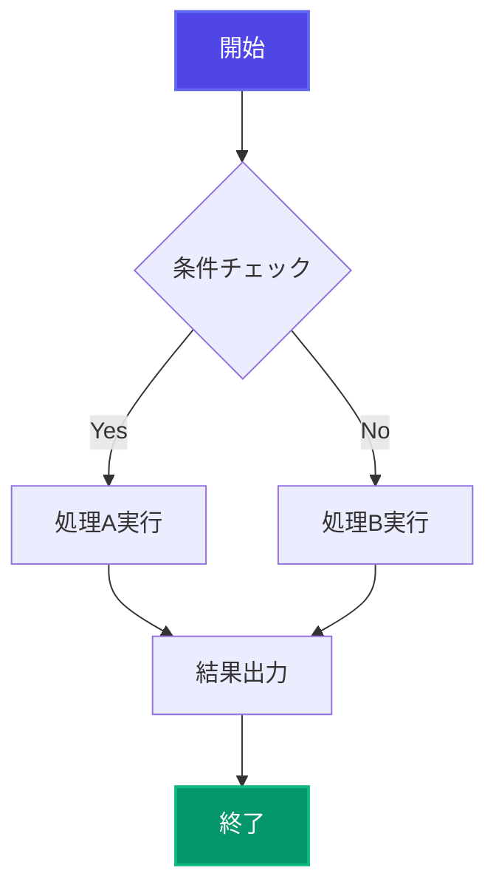
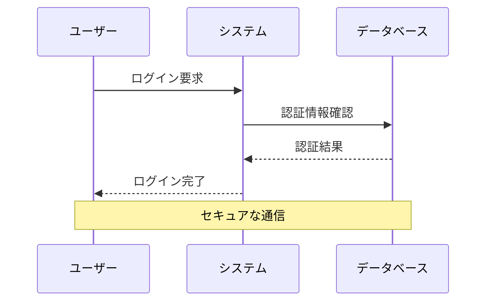
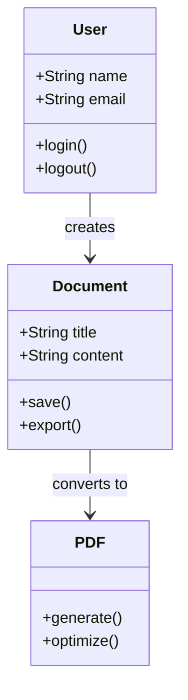

# PDF機能完全テストドキュメント

このドキュメントは修正されたPDF機能をテストするためのものです。

## 1. 改ページ制御のテスト

この章は改ページされないようにセクション化されています。H2見出しの前で改ページが発生します。

### 1.1 基本テキスト

これは通常のテキストです。Lorem ipsum dolor sit amet, consectetur adipiscing elit. Sed do eiusmod tempor incididunt ut labore et dolore magna aliqua.

### 1.2 リスト項目

- 項目1: 重要な機能
- 項目2: 副次的な機能
- 項目3: 補助的な機能

### 1.3 コードブロック

```typescript
function testFunction() {
  console.log("このコードブロックは改ページされません");
  return true;
}
```

## 2. 画像サイズ指定のテスト

### 2.1 通常の画像（サイズ指定なし）


### 2.2 幅指定の画像


### 2.3 幅と高さ指定の画像


## 3. Mermaidダイアグラムのテスト

### 3.1 フローチャート（美しいスタイル）



### 3.2 シーケンス図



### 3.3 クラス図



### 3.4 アーキテクチャ図（Beta版）


### 3.5 インフラ構成図（アイコン表示）


## 4. テーブルのテスト

| 機能 | 実装状況 | 優先度 | 備考 |
|------|----------|--------|------|
| 改ページ防止 | ✅ 完了 | 高 | 章単位でセクション化 |
| 画像サイズ指定 | ✅ 完了 | 高 | =width x height記法 |
| 目次自動生成 | ✅ 完了 | 中 | 見出しから自動生成 |
| Mermaidスタイル | ✅ 完了 | 中 | 4つのテーマ対応 |

## 5. 引用とコードの混在テスト

> このセクションでは引用文とコードブロックが混在しています。
> 
> すべてが適切に改ページ制御されるかをテストします。

```javascript
// 重要なコード例
const config = {
  pageBreak: {
    beforeH1: true,
    beforeH2: true  // デフォルトで有効
  },
  toc: {
    enabled: true   // 目次自動生成
  }
};
```

> 上記の設定により、章レベルでの改ページ制御と目次生成が可能になります。

## 6. 長いコンテンツのテスト

この章は意図的に長いコンテンツを含んでおり、改ページ動作をテストします。

Lorem ipsum dolor sit amet, consectetur adipiscing elit. Sed do eiusmod tempor incididunt ut labore et dolore magna aliqua. Ut enim ad minim veniam, quis nostrud exercitation ullamco laboris nisi ut aliquip ex ea commodo consequat.

Duis aute irure dolor in reprehenderit in voluptate velit esse cillum dolore eu fugiat nulla pariatur. Excepteur sint occaecat cupidatat non proident, sunt in culpa qui officia deserunt mollit anim id est laborum.

### 6.1 サブセクション

Sed ut perspiciatis unde omnis iste natus error sit voluptatem accusantium doloremque laudantium, totam rem aperiam, eaque ipsa quae ab illo inventore veritatis et quasi architecto beatae vitae dicta sunt explicabo.

### 6.2 最終確認

Nemo enim ipsam voluptatem quia voluptas sit aspernatur aut odit aut fugit, sed quia consequuntur magni dolores eos qui ratione voluptatem sequi nesciunt.

---

**テスト完了**: このドキュメントには修正されたすべての機能が含まれています。