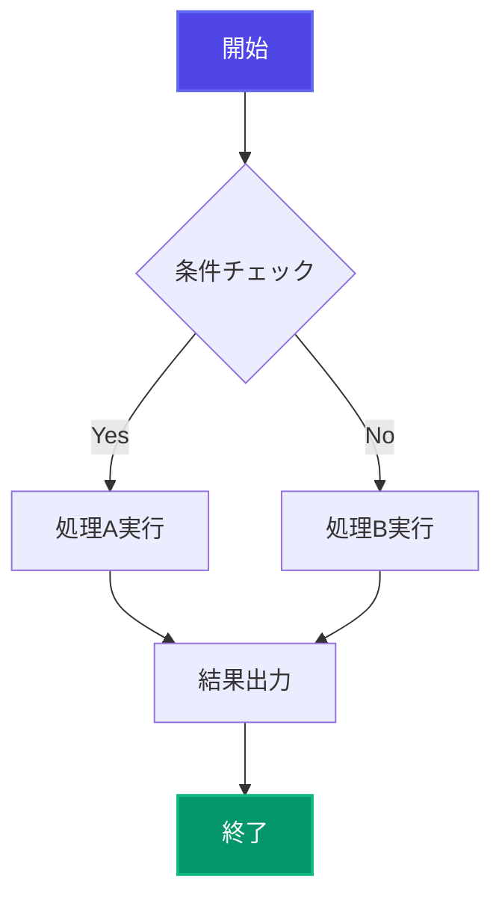

# フローチャートテスト

## スタイル付きフローチャート

```mermaid
flowchart TD
    A[開始] --> B{条件チェック}
    B -->|Yes| C[処理A実行]
    B -->|No| D[処理B実行]
    C --> E[結果出力]
    D --> E
    E --> F[終了]

    style A fill:#4F46E5,stroke:#6366F1,stroke-width:2px,color:#fff
    style F fill:#059669,stroke:#10B981,stroke-width:2px,color:#fff
```
