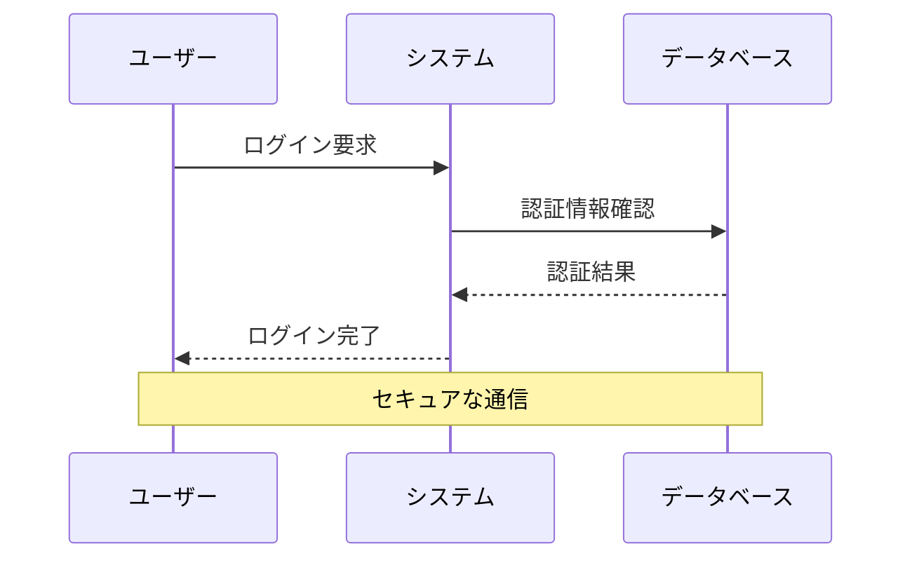

# シーケンス図テスト

## ユーザー認証フロー

```mermaid
sequenceDiagram
    participant U as ユーザー
    participant S as システム
    participant D as データベース

    U->>S: ログイン要求
    S->>D: 認証情報確認
    D-->>S: 認証結果
    S-->>U: ログイン完了

    Note over U,D: セキュアな通信
```
